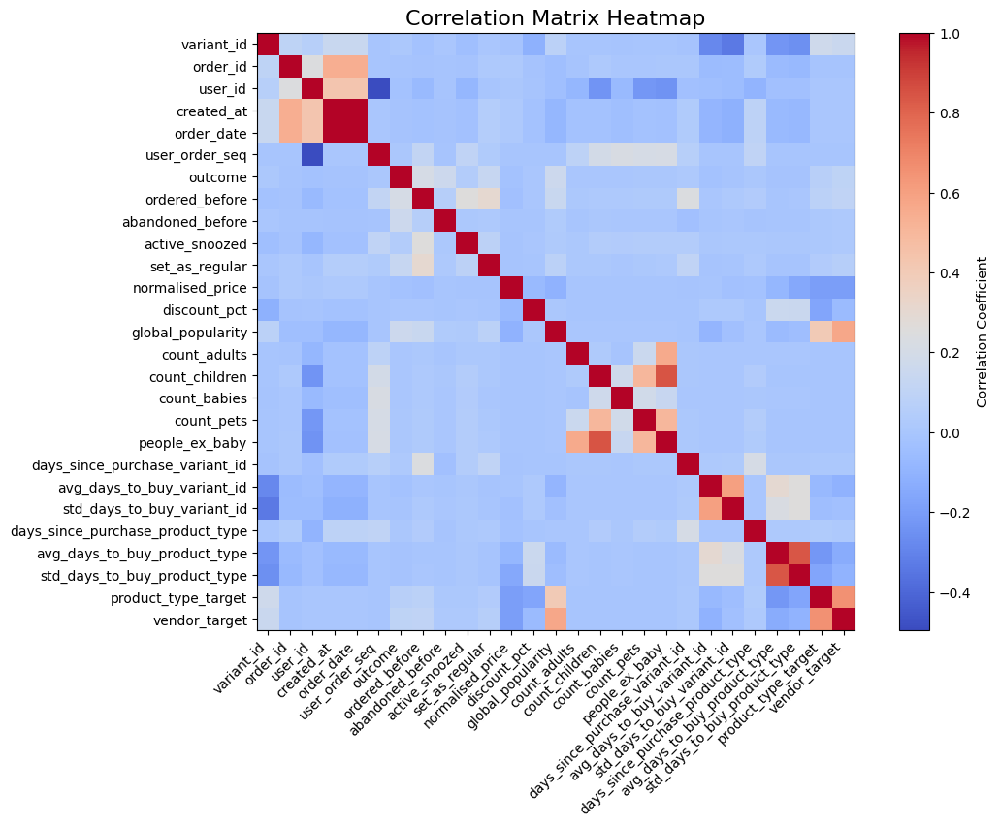

# **Module_2: Exploratory Data Analysis**
## **B. Exploratoty Data Analysis**
### **1- Load dataset into a DataFrame**


```python
import pandas as pd
import os

os.chdir('/home/miguel/zrive-ds')

dataset_path = "data/groceries/sampled_box_builder_df.csv"
df = pd.read_csv(dataset_path)

# Display basic information about the dataset
print(df.shape)
print("\nDataset Info:")
df.info()
```


    ---------------------------------------------------------------------------

    KeyboardInterrupt                         Traceback (most recent call last)

    Cell In[108], line 7
          4 os.chdir('/home/miguel/zrive-ds')
          6 dataset_path = "data/groceries/sampled_box_builder_df.csv"
    ----> 7 df = pd.read_csv(dataset_path)
          9 # Display basic information about the dataset
         10 print(df.shape)


    File ~/.cache/pypoetry/virtualenvs/zrive-ds-faYnIO2J-py3.11/lib/python3.11/site-packages/pandas/io/parsers/readers.py:1026, in read_csv(filepath_or_buffer, sep, delimiter, header, names, index_col, usecols, dtype, engine, converters, true_values, false_values, skipinitialspace, skiprows, skipfooter, nrows, na_values, keep_default_na, na_filter, verbose, skip_blank_lines, parse_dates, infer_datetime_format, keep_date_col, date_parser, date_format, dayfirst, cache_dates, iterator, chunksize, compression, thousands, decimal, lineterminator, quotechar, quoting, doublequote, escapechar, comment, encoding, encoding_errors, dialect, on_bad_lines, delim_whitespace, low_memory, memory_map, float_precision, storage_options, dtype_backend)
       1013 kwds_defaults = _refine_defaults_read(
       1014     dialect,
       1015     delimiter,
       (...)
       1022     dtype_backend=dtype_backend,
       1023 )
       1024 kwds.update(kwds_defaults)
    -> 1026 return _read(filepath_or_buffer, kwds)


    File ~/.cache/pypoetry/virtualenvs/zrive-ds-faYnIO2J-py3.11/lib/python3.11/site-packages/pandas/io/parsers/readers.py:626, in _read(filepath_or_buffer, kwds)
        623     return parser
        625 with parser:
    --> 626     return parser.read(nrows)


    File ~/.cache/pypoetry/virtualenvs/zrive-ds-faYnIO2J-py3.11/lib/python3.11/site-packages/pandas/io/parsers/readers.py:1923, in TextFileReader.read(self, nrows)
       1916 nrows = validate_integer("nrows", nrows)
       1917 try:
       1918     # error: "ParserBase" has no attribute "read"
       1919     (
       1920         index,
       1921         columns,
       1922         col_dict,
    -> 1923     ) = self._engine.read(  # type: ignore[attr-defined]
       1924         nrows
       1925     )
       1926 except Exception:
       1927     self.close()


    File ~/.cache/pypoetry/virtualenvs/zrive-ds-faYnIO2J-py3.11/lib/python3.11/site-packages/pandas/io/parsers/c_parser_wrapper.py:236, in CParserWrapper.read(self, nrows)
        234     chunks = self._reader.read_low_memory(nrows)
        235     # destructive to chunks
    --> 236     data = _concatenate_chunks(chunks)
        238 else:
        239     data = self._reader.read(nrows)


    File ~/.cache/pypoetry/virtualenvs/zrive-ds-faYnIO2J-py3.11/lib/python3.11/site-packages/pandas/io/parsers/c_parser_wrapper.py:376, in _concatenate_chunks(chunks)
        374     result[name] = union_categoricals(arrs, sort_categories=False)
        375 else:
    --> 376     result[name] = concat_compat(arrs)
        377     if len(non_cat_dtypes) > 1 and result[name].dtype == np.dtype(object):
        378         warning_columns.append(str(name))


    File ~/.cache/pypoetry/virtualenvs/zrive-ds-faYnIO2J-py3.11/lib/python3.11/site-packages/pandas/core/dtypes/concat.py:78, in concat_compat(to_concat, axis, ea_compat_axis)
         76 if isinstance(obj, np.ndarray):
         77     to_concat_arrs = cast("Sequence[np.ndarray]", to_concat)
    ---> 78     return np.concatenate(to_concat_arrs, axis=axis)
         80 to_concat_eas = cast("Sequence[ExtensionArray]", to_concat)
         81 if ea_compat_axis:
         82     # We have 1D objects, that don't support axis keyword


    KeyboardInterrupt: 


### **2- Check for missing values and handle them**


```python
# Check for missing values
missing_values = df.isnull().sum()
missing_percentage = (missing_values / len(df)) * 100

# Display missing value summary
missing_summary = pd.DataFrame({"Missing Count": missing_values, "Missing Percentage": missing_percentage})
print("Missing Values Summary:")
print(missing_summary)

```

    Missing Values Summary:
                                      Missing Count  Missing Percentage
    variant_id                                    0                 0.0
    product_type                                  0                 0.0
    order_id                                      0                 0.0
    user_id                                       0                 0.0
    created_at                                    0                 0.0
    order_date                                    0                 0.0
    user_order_seq                                0                 0.0
    outcome                                       0                 0.0
    ordered_before                                0                 0.0
    abandoned_before                              0                 0.0
    active_snoozed                                0                 0.0
    set_as_regular                                0                 0.0
    normalised_price                              0                 0.0
    discount_pct                                  0                 0.0
    vendor                                        0                 0.0
    global_popularity                             0                 0.0
    count_adults                                  0                 0.0
    count_children                                0                 0.0
    count_babies                                  0                 0.0
    count_pets                                    0                 0.0
    people_ex_baby                                0                 0.0
    days_since_purchase_variant_id                0                 0.0
    avg_days_to_buy_variant_id                    0                 0.0
    std_days_to_buy_variant_id                    0                 0.0
    days_since_purchase_product_type              0                 0.0
    avg_days_to_buy_product_type                  0                 0.0
    std_days_to_buy_product_type                  0                 0.0


### **3- Check data types**


```python
# Check data types
print("Data Types:")
print(df.dtypes)
```

    Data Types:
    variant_id                            int64
    product_type                         object
    order_id                              int64
    user_id                               int64
    created_at                           object
    order_date                           object
    user_order_seq                        int64
    outcome                             float64
    ordered_before                      float64
    abandoned_before                    float64
    active_snoozed                      float64
    set_as_regular                      float64
    normalised_price                    float64
    discount_pct                        float64
    vendor                               object
    global_popularity                   float64
    count_adults                        float64
    count_children                      float64
    count_babies                        float64
    count_pets                          float64
    people_ex_baby                      float64
    days_since_purchase_variant_id      float64
    avg_days_to_buy_variant_id          float64
    std_days_to_buy_variant_id          float64
    days_since_purchase_product_type    float64
    avg_days_to_buy_product_type        float64
    std_days_to_buy_product_type        float64
    dtype: object


```python
if df['set_as_regular'].unique()[0] == 0 and df['set_as_regular'].unique()[1] == 1: df['set_as_regular'] = df['set_as_regular'].astype('uint8')
if df['active_snoozed'].unique()[0] == 0 and df['active_snoozed'].unique()[1] == 1: df['active_snoozed'] = df['active_snoozed'].astype('uint8')
if df['abandoned_before'].unique()[0] == 0 and df['abandoned_before'].unique()[1] == 1: df['abandoned_before'] = df['abandoned_before'].astype('uint8')
if df['ordered_before'].unique()[0] == 0 and df['ordered_before'].unique()[1] == 1: df['ordered_before'] = df['ordered_before'].astype('uint8')
if df['outcome'].unique()[0] == 0 and df['outcome'].unique()[1] == 1: df['outcome'] = df['outcome'].astype('uint8')

df['created_at'] = pd.to_datetime(df['created_at'], format='%Y-%m-%d %H:%M:%S')
df['order_date'] = pd.to_datetime(df['order_date'], format='%Y-%m-%d %H:%M:%S')

print(df.dtypes)
```

    variant_id                                   int64
    product_type                                object
    order_id                                     int64
    user_id                                      int64
    created_at                          datetime64[ns]
    order_date                          datetime64[ns]
    user_order_seq                               int64
    outcome                                      uint8
    ordered_before                               uint8
    abandoned_before                             uint8
    active_snoozed                               uint8
    set_as_regular                               uint8
    normalised_price                           float64
    discount_pct                               float64
    vendor                                      object
    global_popularity                          float64
    count_adults                               float64
    count_children                             float64
    count_babies                               float64
    count_pets                                 float64
    people_ex_baby                             float64
    days_since_purchase_variant_id             float64
    avg_days_to_buy_variant_id                 float64
    std_days_to_buy_variant_id                 float64
    days_since_purchase_product_type           float64
    avg_days_to_buy_product_type               float64
    std_days_to_buy_product_type               float64
    dtype: object


Logical features converted to `uint8` looking for memory efficience.

### **3- Check for outliers**


```python
import matplotlib.pyplot as plt

# List of columns to plot
numerical_features = ['normalised_price', 'discount_pct', 'global_popularity', 'count_adults',  
                   'count_children', 'count_babies', 'count_pets', 'people_ex_baby',
                   'days_since_purchase_variant_id', 'avg_days_to_buy_variant_id',
                   'std_days_to_buy_variant_id', 'days_since_purchase_product_type', 
                   'avg_days_to_buy_product_type', 'std_days_to_buy_product_type']

num_plots = len(numerical_features)
rows = (num_plots // 4) + (num_plots % 4 > 0) 
fig, axes = plt.subplots(rows, 4, figsize=(20, rows * 5)) 

axes = axes.flatten()

for i, column in enumerate(numerical_features):
    axes[i].boxplot(df[column])
    axes[i].set_title(column)
    axes[i].set_ylabel('Value')
    axes[i].grid(True)

for j in range(i + 1, len(axes)):
    axes[j].axis('off')

plt.tight_layout()
plt.show()
```


    

    


### **4- Check Target Variable**
Ensure the target variable `outcome` is well-balanced.


```python
print("Target Variable Distribution:")
print(df['outcome'].value_counts(normalize=True) * 100)
```

    Target Variable Distribution:
    outcome
    0    98.846331
    1     1.153669
    Name: proportion, dtype: float64


##### **Possible Fixes for Imbalanced Data**

1. **Oversampling**:
   - Duplicate or synthetically generate samples of the minority class to balance the dataset.
   - A common method is **SMOTE (Synthetic Minority Oversampling Technique)**, which creates synthetic samples based on the feature space of existing minority class samples.

2. **Undersampling**:
   - Randomly remove samples from the majority class to balance the dataset.
   - Suitable when the dataset is large and removing data won't lead to a significant loss of information.

3. **Class Weights**:
   - Assign higher weights to the minority class during model training to penalize the model more for misclassifying it.
   - Many machine learning frameworks support this directly, such as scikit-learn's `class_weight='balanced'`.


### **5- Categorical encoding**


```python
# Check cardinality of categorical features
categorical_features = df.select_dtypes(include='object').columns
for feature in categorical_features:
    print(f"{feature}: {df[feature].nunique()} unique values")
```

    product_type: 62 unique values
    vendor: 264 unique values


```python
# Frequency encoding for 'product_type'
frequency_encoding = df['product_type'].value_counts(normalize=True)
df['product_type_freq'] = df['product_type'].map(frequency_encoding)

# Check the result
print(df[['product_type', 'product_type_freq']].head())

freq_corr = df[['product_type_freq', 'outcome']].corr().iloc[0, 1]
print(f"\nCorrelation between frequency-encoded 'product_type' and 'outcome': {freq_corr:.4f}\n")


# Target encoding for 'product_type'
target_mean = df.groupby('product_type')['outcome'].mean()
df['product_type_target'] = df['product_type'].map(target_mean)

# Check the result
print(df[['product_type', 'product_type_target']].head())

target_corr = df[['product_type_target', 'outcome']].corr().iloc[0, 1]
print(f"\nCorrelation between target-encoded 'product_type' and 'outcome': {target_corr:.4f}")
```

          product_type  product_type_freq
    0  ricepastapulses            0.04447
    1  ricepastapulses            0.04447
    2  ricepastapulses            0.04447
    3  ricepastapulses            0.04447
    4  ricepastapulses            0.04447
    
    Correlation between frequency-encoded 'product_type' and 'outcome': 0.0228
    
          product_type  product_type_target
    0  ricepastapulses             0.011983
    1  ricepastapulses             0.011983
    2  ricepastapulses             0.011983
    3  ricepastapulses             0.011983
    4  ricepastapulses             0.011983
    
    Correlation between target-encoded 'product_type' and 'outcome': 0.0705


Target encoding is preferred, but it will be important to implement Cross-Validation in order to avoid information leakage.


```python
df.drop(columns=['product_type_freq'], inplace=True)
```


```python
# Frequency encoding for 'vendor'
frequency_encoding = df['vendor'].value_counts(normalize=True)
df['vendor_freq'] = df['vendor'].map(frequency_encoding)

# Check the result
print(df[['vendor', 'vendor_freq']].head())

freq_corr = df[['vendor_freq', 'outcome']].corr().iloc[0, 1]
print(f"\nCorrelation between frequency-encoded 'vendor' and 'outcome': {freq_corr:.4f}")


# Target encoding for 'vendor'
target_mean = df.groupby('vendor')['outcome'].mean()
df['vendor_target'] = df['vendor'].map(target_mean)

# Check the result
print(df[['vendor', 'vendor_target']].head())

target_corr = df[['vendor_target', 'outcome']].corr().iloc[0, 1]
print(f"\nCorrelation between target-encoded 'vendor' and 'outcome': {target_corr:.4f}")
```

            vendor  vendor_freq
    0  clearspring     0.014356
    1  clearspring     0.014356
    2  clearspring     0.014356
    3  clearspring     0.014356
    4  clearspring     0.014356
    
    Correlation between frequency-encoded 'vendor' and 'outcome': 0.0004
            vendor  vendor_target
    0  clearspring       0.010882
    1  clearspring       0.010882
    2  clearspring       0.010882
    3  clearspring       0.010882
    4  clearspring       0.010882
    
    Correlation between target-encoded 'vendor' and 'outcome': 0.0998


Once again, target encoding is preferred, but it will be important to implement Cross-Validation in order to avoid information leakage.


```python
df.drop(columns=['vendor_freq'], inplace=True)
```

### **6- Check correlations**


```python
# Compute the correlation matrix
correlation_matrix = df.drop(columns=['vendor', 'product_type']).corr()

# Plot heatmap
plt.figure(figsize=(12, 8))
plt.imshow(correlation_matrix, cmap='coolwarm', interpolation='nearest')
plt.colorbar(label='Correlation Coefficient')
plt.xticks(range(len(correlation_matrix.columns)), correlation_matrix.columns, rotation=45, ha='right')
plt.yticks(range(len(correlation_matrix.columns)), correlation_matrix.columns)
plt.title('Correlation Matrix Heatmap', fontsize=16)
plt.show()

```


    

    


### **7- Some data knowledge & conclusions**


```python
binary_cols = df.select_dtypes(include='uint8').columns

for col in binary_cols.drop('outcome'):
    print(f"Value counts {col}: {df[col].value_counts().to_dict()}")
    print(f"Mean outcome by {col} value: {df.groupby(col)['outcome'].mean().to_dict()}")
    print('---------------------------------------------------------------------------')
```

    Value counts ordered_before: {0: 2819658, 1: 60891}
    Mean outcome by ordered_before value: {0: 0.008223337723936732, 1: 0.1649669080816541}
    ---------------------------------------------------------------------------
    Value counts abandoned_before: {0: 2878794, 1: 1755}
    Mean outcome by abandoned_before value: {0: 0.011106039542947498, 1: 0.717948717948718}
    ---------------------------------------------------------------------------
    Value counts active_snoozed: {0: 2873952, 1: 6597}
    Mean outcome by active_snoozed value: {0: 0.011302554809544488, 1: 0.1135364559648325}
    ---------------------------------------------------------------------------
    Value counts set_as_regular: {0: 2870093, 1: 10456}
    Mean outcome by set_as_regular value: {0: 0.010668992259135854, 1: 0.24971308339709258}
    ---------------------------------------------------------------------------


We clearly see a big difference between mean outcome values in products with the following tags: `ordered_before`, `abandoned_before`, `active_snoozed` & `set_as_regular`. Specially interesting results for `abandoned_before`, where 71% of abandoned products are bought in an afterward order. Consider value of building a new logic feature (tag) named `interacted_before` involving these 4 types of user interaction.


```python
variant_outcome = df.groupby('variant_id')['outcome'].sum().reset_index()
variant_outcome = variant_outcome.sort_values(by='outcome', ascending=False)
top_variants = variant_outcome.head(20)

plt.figure(figsize=(12, 6))
plt.bar(top_variants['variant_id'].astype(str), top_variants['outcome'])
plt.xticks(rotation=90)
plt.xlabel("Variant ID")
plt.ylabel("Total Outcome")
plt.title("Total Sells per Product")
plt.show()
```


    

    


Here has been displayed the amount of positive outcomes (completed sells) for each product. The first and most remarkable conclusion is that the company has a star-product, which is sold more than twice the second one. Let's find out some info about these top products.


```python
top_variants = variant_outcome.head(5).merge(df[['variant_id', 'product_type', 'vendor']], on='variant_id', how='left')
top_variants = top_variants.drop_duplicates(subset='variant_id')

print("\nTop 5 Products:")
print(top_variants.to_string(index=False))
```

    
    Top 5 Products:
        variant_id  outcome            product_type         vendor
    34081589887108     1106 longlifemilksubstitutes          oatly
    34370915041412      331       tinspackagedfoods          mutti
    33973249081476      297     condimentsdressings          heinz
    33667282436228      288      kitchenrolltissues thecheekypanda
    34370361229444      270              toiletroll  whogivesacrap


From here we know that the star-product is a pack of oat milk.


```python
vendor_outcome = df.groupby('vendor')['outcome'].sum().reset_index()
vendor_outcome = vendor_outcome.sort_values(by='outcome', ascending=False)
top_vendors = vendor_outcome.head(20)

plt.figure(figsize=(12, 6))
plt.bar(top_vendors['vendor'].astype(str), top_vendors['outcome'])
plt.xticks(rotation=90)
plt.xlabel("Vendor")
plt.ylabel("Total Outcome")
plt.title("Total Sells per Brand")
plt.show()
```


    

    


From this bar graph, which plots the top-selled brands at our supermarket, we can understand better our market orientation: the top 5 selled brands are all related with eco/bio products, so it is a good assumption that our company aims at that client profile. If not, there would be some important questions to answer: why are we engaging a determined style of user? is this positive for the company? should we increase our offer of bio/eco products?


```python
monthly_orders = df.groupby(df['order_date'].dt.to_period("W"))['order_id'].nunique().reset_index()
monthly_orders['order_date'] = monthly_orders['order_date'].astype(str)

plt.figure(figsize=(12, 6))
plt.plot(monthly_orders['order_date'], monthly_orders['order_id'], marker='o', linestyle='-')
plt.ylabel("Order Count")
plt.title("Weekly Order Count Over Time")
plt.xticks(rotation=45)  
plt.show()
```


    

    


Looking at this plot, it is easy to figure out that within this period (Nov 2020 - Mar 2021, COVID pandemic period) the company was growing, increasing sells. It would be relevant to see some data for periods after the pandemic, when online supermarkets may have suffered a downturn. Disclaimer: do not make any conclusions from the last point of the graph, which is probably explained by an unfinished time period (week in this case).
