## Module 5: Analyse, diagnose and improve a model​

In the excercise of this week you will be working with financial data in order to (hopefully) find a portfolio of equities which outperform SP500. The data that you are gonna work with has two main sources: 
* Financial data from the companies extracted from the quarterly company reports (mostly extracted from [macrotrends](https://www.macrotrends.net/) so you can use this website to understand better the data and get insights on the features, for example [this](https://www.macrotrends.net/stocks/charts/AAPL/apple/revenue) is the one corresponding to APPLE)
* Stock prices, mostly extracted from [morningstar](https://indexes.morningstar.com/page/morningstar-indexes-empowering-investor-success?utm_source=google&utm_medium=cpc&utm_campaign=MORNI%3AG%3ASearch%3ABrand%3ACore%3AUK%20MORNI%3ABrand%3ACore%3ABroad&utm_content=engine%3Agoogle%7Ccampaignid%3A18471962329%7Cadid%3A625249340069&utm_term=morningstar%20index&gclid=CjwKCAjws9ipBhB1EiwAccEi1Fu6i20XHVcxFxuSEtJGF0If-kq5-uKnZ3rov3eRkXXFfI5j8QBtBBoCayEQAvD_BwE), which basically tell us how the stock price is evolving so we can use it both as past features and the target to predict).

Before going to the problem that we want to solve, let's comment some of the columns of the dataset:


* `Ticker`: a [short name](https://en.wikipedia.org/wiki/Ticker_symbol) to identify the equity (that you can use to search in macrotrends)
* `date`: the date of the company report (normally we are gonna have 1 every quarter). This is for informative purposes but you can ignore it when modeling.
* `execution date`: the date when we would had executed the algorithm for that equity. We want to execute the algorithm once per quarter to create the portfolio, but the release `date`s of all the different company reports don't always match for the quarter, so we just take a common `execution_date` for all of them.
* `stock_change_div_365`: what is the % change of the stock price (with dividens) in the FOLLOWING year after `execution date`. 
* `sp500_change_365`: what is the % change of the SP500 in the FOLLOWING year after `execution date`.
* `close_0`: what is the price at the moment of `execution date`
* `stock_change__minus_120` what is the % change of the stock price in the last 120 days
* `stock_change__minus_730`: what is the % change of the stock price in the last 730 days

The rest of the features can be divided beteween financial features (the ones coming from the reports) and technical features (coming from the stock price). We leave the technical features here as a reference: 


```python
technical_features = ['close_0', 'close_sp500_0', 'close_365', 'close_sp500_365',
       'close__minus_120', 'close_sp500__minus_120', 'close__minus_365',
       'close_sp500__minus_365', 'close__minus_730', 'close_sp500__minus_730',
       'stock_change_365','stock_change_div_365', 'sp500_change_365', 'stock_change__minus_120',
       'sp500_change__minus_120', 'stock_change__minus_365',
       'sp500_change__minus_365', 'stock_change__minus_730','sp500_change__minus_730',
       'std__minus_365','std__minus_730','std__minus_120']
```

The problem that we want to solve is basically find a portfolio of `top_n` tickers (initially set to 10) to invest every `execution date` (basically once per quarter) and the goal is to have a better return than `SP500` in the following year. The initial way to model this is to have a binary target which is 1 when `stock_change_div_365` - `sp500_change_365` (the difference between the return of the equity and the SP500 in the following year) is positive or 0 otherwise. So we try to predict the probability of an equity of improving SP500 in the following year, we take the `top_n` equities and compute their final return.


```python
import pandas as pd
import re
import numpy as np
import lightgbm as lgb
from plotnine import ggplot, geom_histogram, aes, geom_col, coord_flip,geom_bar,scale_x_discrete, geom_point, theme,element_text, theme_minimal
```


```python
# number of trees in lightgbm
n_trees = 40
minimum_number_of_tickers = 1500
# Number of the quarters in the past to train
n_train_quarters = 36
# number of tickers to make the portfolio
top_n = 10
```


```python
import os
os.chdir('/home/miguel/zrive-ds')
data_set = pd.read_feather("data/finances/financials_against_return.feather")
```

Remove these quarters which have les than `minimum_number_of_tickers` tickers:


```python
df_quarter_lengths = data_set.groupby(["execution_date"]).size().reset_index().rename(columns = {0:"count"})
data_set = pd.merge(data_set, df_quarter_lengths, on = ["execution_date"])
data_set = data_set[data_set["count"]>=minimum_number_of_tickers]
```


```python
data_set.shape
```


    (170483, 145)


Create the target:


```python
data_set["diff_ch_sp500"] = data_set["stock_change_div_365"] - data_set["sp500_change_365"]

data_set.loc[data_set["diff_ch_sp500"]>0,"target"] = 1
data_set.loc[data_set["diff_ch_sp500"]<0,"target"] = 0

data_set["target"].value_counts()
```


    target
    0.0    82437
    1.0    73829
    Name: count, dtype: int64


This function computes the main metric that we want to optimize: given a prediction where we have probabilities for each equity, we sort the equities in descending order of probability, we pick the `top_n` ones, and we we weight the returned `diff_ch_sp500` by the probability:


```python
def get_weighted_performance_of_stocks(df,metric):
    df["norm_prob"] = 1/len(df)
    return np.sum(df["norm_prob"]*df[metric])

def get_top_tickers_per_prob(preds):
    if len(preds) == len(train_set):
        data_set = train_set.copy()
    elif len(preds) == len(test_set):
        data_set = test_set.copy()
    else:
        assert ("Not matching train/test")
    data_set["prob"] = preds
    data_set = data_set.sort_values(["prob"], ascending = False)
    data_set = data_set.head(top_n)
    return data_set

# main metric to evaluate: average diff_ch_sp500 of the top_n stocks
def top_wt_performance(preds, train_data):
    top_dataset = get_top_tickers_per_prob(preds)
    return "weighted-return", get_weighted_performance_of_stocks(top_dataset,"diff_ch_sp500"), True
```

We have created for you a function to make the `train` and `test` split based on a `execution_date`:


```python
def split_train_test_by_period(data_set, test_execution_date,include_nulls_in_test = False):
    # we train with everything happening at least one year before the test execution date
    train_set = data_set.loc[data_set["execution_date"] <= pd.to_datetime(test_execution_date) - pd.Timedelta(350, unit = "day")]
    # remove those rows where the target is null
    train_set = train_set[~pd.isna(train_set["diff_ch_sp500"])]
    execution_dates = train_set.sort_values("execution_date")["execution_date"].unique()
    # Pick only the last n_train_quarters
    if n_train_quarters!=None:
        train_set = train_set[train_set["execution_date"].isin(execution_dates[-n_train_quarters:])]
        
    # the test set are the rows happening in the execution date with the concrete frequency
    test_set = data_set.loc[(data_set["execution_date"] == test_execution_date)]
    if not include_nulls_in_test:
        test_set = test_set[~pd.isna(test_set["diff_ch_sp500"])]
    test_set = test_set.sort_values('date', ascending = False).drop_duplicates('Ticker', keep = 'first')
    
    return train_set, test_set
```

Ensure that we don't include features which are irrelevant or related to the target:


```python
def get_columns_to_remove():
    columns_to_remove = [
                         "date",
                         "improve_sp500",
                         "Ticker",
                         "freq",
                         "set",
                         "close_sp500_365",
                         "close_365",
                         "stock_change_365",
                         "sp500_change_365",
                         "stock_change_div_365",
                         "stock_change_730",
                         "sp500_change_365",
                         "stock_change_div_730",
                         "diff_ch_sp500",
                         "diff_ch_avg_500",
                         "execution_date","target","index","quarter","std_730","count"]
        
    return columns_to_remove
```

This is the main modeling function, it receives a train test and a test set and trains a `lightgbm` in classification mode. We don't recommend to change the main algorithm for this excercise but we suggest to play with its hyperparameters:


```python
import warnings
warnings.filterwarnings('ignore')


def train_model(train_set,test_set,n_estimators = 300):

    columns_to_remove = get_columns_to_remove()
    
    X_train = train_set.drop(columns = columns_to_remove, errors = "ignore")
    X_test = test_set.drop(columns = columns_to_remove, errors = "ignore")
    
    
    y_train = train_set["target"]
    y_test = test_set["target"]

    lgb_train = lgb.Dataset(X_train,y_train)
    lgb_test = lgb.Dataset(X_test, y_test, reference=lgb_train)
    
    eval_result = {}
    
 
    objective = 'binary'
    metric = 'binary_logloss' 
    params = {
             "random_state":1, 
             "verbosity": -1,
             "n_jobs":10, 
             "n_estimators":n_estimators,
             "objective": objective,
             "metric": metric}
    
    model = lgb.train(params = params,
                      train_set = lgb_train,
                      valid_sets = [lgb_train, lgb_test],
                      valid_names=["Train", "Test"],
                      feval = [top_wt_performance],
                      callbacks = [lgb.record_evaluation(eval_result = eval_result)])
    return model,eval_result,X_train,X_test


 
            
```

This is the function which receives an `execution_date` and splits the dataset between train and test, trains the models and evaluates the model in test. It returns a dictionary with the different evaluation metrics in train and test:


```python
def run_model_for_execution_date(execution_date,all_results,all_predicted_tickers_list,all_models,n_estimators,include_nulls_in_test = False):
        global train_set
        global test_set
        # split the dataset between train and test
        train_set, test_set = split_train_test_by_period(data_set,execution_date,include_nulls_in_test = include_nulls_in_test)
        train_size, _ = train_set.shape
        test_size, _ = test_set.shape
        model = None
        X_train = None
        X_test = None
        
        # if both train and test are not empty
        if train_size > 0 and test_size>0:
            model, evals_result, X_train, X_test = train_model(train_set,
                                                              test_set,
                                                              n_estimators = n_estimators)
            
            test_set['prob'] = model.predict(X_test)
            predicted_tickers = test_set.sort_values('prob', ascending = False)
            predicted_tickers["execution_date"] = execution_date
            all_results[(execution_date)] = evals_result
            all_models[(execution_date)] = model
            all_predicted_tickers_list.append(predicted_tickers)
        return all_results,all_predicted_tickers_list,all_models,model,X_train,X_test


execution_dates = np.sort( data_set['execution_date'].unique() )

```

This is the main training loop: it goes through each different `execution_date` and calls `run_model_for_execution_date`. All the results are stored in `all_results` and the predictions in `all_predicted_tickers_list`.


```python
all_results = {}
all_predicted_tickers_list = []
all_models = {}

for execution_date in execution_dates:
    print(execution_date)
    all_results,all_predicted_tickers_list,all_models,model,X_train,X_test = run_model_for_execution_date(execution_date,all_results,all_predicted_tickers_list,all_models,n_trees,False)
all_predicted_tickers = pd.concat(all_predicted_tickers_list) 
```

    2005-06-30T00:00:00.000000000
    2005-09-30T00:00:00.000000000
    2005-12-30T00:00:00.000000000
    2006-03-31T00:00:00.000000000
    2006-06-30T00:00:00.000000000
    2006-09-30T00:00:00.000000000
    2006-12-30T00:00:00.000000000
    2007-03-31T00:00:00.000000000
    2007-06-30T00:00:00.000000000
    2007-09-30T00:00:00.000000000
    2007-12-30T00:00:00.000000000
    2008-03-31T00:00:00.000000000
    2008-06-30T00:00:00.000000000
    2008-09-30T00:00:00.000000000
    2008-12-30T00:00:00.000000000
    2009-03-31T00:00:00.000000000
    2009-06-30T00:00:00.000000000
    2009-09-30T00:00:00.000000000
    2009-12-30T00:00:00.000000000
    2010-03-31T00:00:00.000000000
    2010-06-30T00:00:00.000000000
    2010-09-30T00:00:00.000000000
    2010-12-30T00:00:00.000000000
    2011-03-31T00:00:00.000000000
    2011-06-30T00:00:00.000000000
    2011-09-30T00:00:00.000000000
    2011-12-30T00:00:00.000000000
    2012-03-31T00:00:00.000000000
    2012-06-30T00:00:00.000000000
    2012-09-30T00:00:00.000000000
    2012-12-30T00:00:00.000000000
    2013-03-31T00:00:00.000000000
    2013-06-30T00:00:00.000000000
    2013-09-30T00:00:00.000000000
    2013-12-30T00:00:00.000000000
    2014-03-31T00:00:00.000000000
    2014-06-30T00:00:00.000000000
    2014-09-30T00:00:00.000000000
    2014-12-30T00:00:00.000000000
    2015-03-31T00:00:00.000000000
    2015-06-30T00:00:00.000000000
    2015-09-30T00:00:00.000000000
    2015-12-30T00:00:00.000000000
    2016-03-31T00:00:00.000000000
    2016-06-30T00:00:00.000000000
    2016-09-30T00:00:00.000000000
    2016-12-30T00:00:00.000000000
    2017-03-31T00:00:00.000000000
    2017-06-30T00:00:00.000000000
    2017-09-30T00:00:00.000000000
    2017-12-30T00:00:00.000000000
    2018-03-31T00:00:00.000000000
    2018-06-30T00:00:00.000000000
    2018-09-30T00:00:00.000000000
    2018-12-30T00:00:00.000000000
    2019-03-31T00:00:00.000000000
    2019-06-30T00:00:00.000000000
    2019-09-30T00:00:00.000000000
    2019-12-30T00:00:00.000000000
    2020-03-31T00:00:00.000000000
    2020-06-30T00:00:00.000000000
    2020-09-30T00:00:00.000000000
    2020-12-30T00:00:00.000000000
    2021-03-27T00:00:00.000000000


```python
def parse_results_into_df(set_):
    df = pd.DataFrame()
    for date in all_results:
        df_tmp = pd.DataFrame(all_results[(date)][set_])
        df_tmp["n_trees"] = list(range(len(df_tmp)))
        df_tmp["execution_date"] = date
        df= pd.concat([df,df_tmp])
    
    df["execution_date"] = df["execution_date"].astype(str)
    
    return df
```


```python
test_results = parse_results_into_df("Test")
train_results = parse_results_into_df("Train")
```


```python
test_results_final_tree = test_results.sort_values(["execution_date","n_trees"]).drop_duplicates("execution_date",keep = "last")
train_results_final_tree = train_results.sort_values(["execution_date","n_trees"]).drop_duplicates("execution_date",keep = "last")

```

And this are the results:


```python
ggplot(test_results_final_tree) + geom_point(aes(x = "execution_date", y = "weighted-return")) + theme(axis_text_x = element_text(angle = 90, vjust = 0.5, hjust=1))
```


    
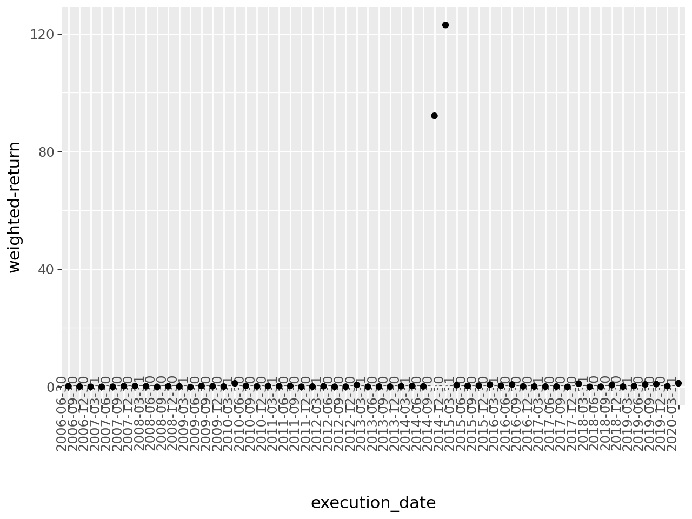
    


```python
ggplot(train_results_final_tree) + geom_point(aes(x = "execution_date", y = "weighted-return")) + theme(axis_text_x = element_text(angle = 90, vjust = 0.5, hjust=1))

```


    
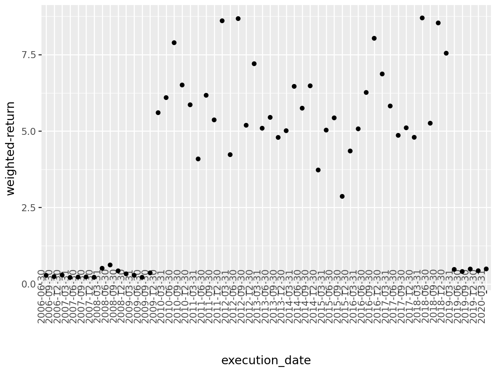
    


We have trained the first models for all the periods for you, but there are a lot of things which may be wrong or can be improved. Some ideas where you can start:
* Try to see if there is any kind of data leakage or suspicious features
* If the training part is very slow, try to see how you can modify it to execute faster tests
* Try to understand if the algorithm is learning correctly
* We are using a very high level metric to evaluate the algorithm so you maybe need to use some more low level ones
* Try to see if there is overfitting
* Try to see if there is a lot of noise between different trainings
* To simplify, why if you only keep the first tickers in terms of Market Cap?
* Change the number of quarters to train in the past

This function can be useful to compute the feature importance:


```python
def draw_feature_importance(model,top = 15): # NO USAR, NO ES LA MEJOR
    fi = model.feature_importance()
    fn = model.feature_name()
    feature_importance = pd.DataFrame([{"feature":fn[i],"imp":fi[i]} for i in range(len(fi))])
    feature_importance = feature_importance.sort_values("imp",ascending = False).head(top)
    feature_importance = feature_importance.sort_values("imp",ascending = True)
    plot = ggplot(feature_importance,aes(x = "feature",y  = "imp")) + geom_col(fill = "lightblue") + coord_flip() +  scale_x_discrete(limits = feature_importance["feature"])
    return plot

```


```python
from scipy.stats import lognorm
import matplotlib.pyplot as plt
```

---

# Proposed modifications:


```python
train_outperformance = train_results_final_tree[train_results_final_tree['weighted-return'] > 0].shape[0] / train_results_final_tree.shape[0]
test_outperformance = test_results_final_tree[test_results_final_tree['weighted-return'] > 0].shape[0] / test_results_final_tree.shape[0]
print(f'Percentage of execution dates in which the chosen portfolio outperforms SP500 in train dataset: {round(train_outperformance*100, 2)}')
print(f'Percentage of execution dates in which the chosen portfolio outperforms SP500 in test dataset: {round(test_outperformance*100, 2)}')
print('\n')
mean_train_performance_difference = train_results_final_tree['weighted-return'].mean()
mean_test_performance_difference = test_results_final_tree['weighted-return'].mean()
print(f'Mean difference in performance (between our portfolio and SP500) for train dataset: {round(mean_train_performance_difference, 4)}')
print(f'Mean difference in performance (between our portfolio and SP500) for test dataset: {round(mean_test_performance_difference, 4)}')
print('\n')
median_train_performance_difference = train_results_final_tree['weighted-return'].median()
median_test_performance_difference = test_results_final_tree['weighted-return'].median()
print(f'Median difference in performance (between our portfolio and SP500) for train dataset: {round(median_train_performance_difference, 4)}')
print(f'Median difference in performance (between our portfolio and SP500) for test dataset: {round(median_test_performance_difference, 4)}')
```

    Percentage of execution dates in which the chosen portfolio outperforms SP500 in train dataset: 100.0
    Percentage of execution dates in which the chosen portfolio outperforms SP500 in test dataset: 71.43
    
    
    Mean difference in performance (between our portfolio and SP500) for train dataset: 4.0254
    Mean difference in performance (between our portfolio and SP500) for test dataset: 4.029
    
    
    Median difference in performance (between our portfolio and SP500) for train dataset: 5.0203
    Median difference in performance (between our portfolio and SP500) for test dataset: 0.1047


Firstly, as it can be seen in the plotted graphs, there is a significant difference between performance in train and test: for train data, we obtain a 100% outperformance rate over SP-500, whilst in test data it reduces to a 71.43%. Even more concerning: the median difference in performance in train is around 5, while only 0.1 is observed in test. The mean values are much closer since in test, we encounter some big outliers which favour the results for our model. These big differences between train and test performance suggests a problem of either overfitting, information leakage, or even both at the same time. Let's check feature importance:


```python
last_execution_date = '2021-03-27T00:00:00.000000000'

train_set, test_set = split_train_test_by_period(data_set,last_execution_date,include_nulls_in_test = True)
model, eval_result, X_train, X_test = train_model(train_set,test_set,n_estimators = 300)
draw_feature_importance(model,top = 15)
```


    
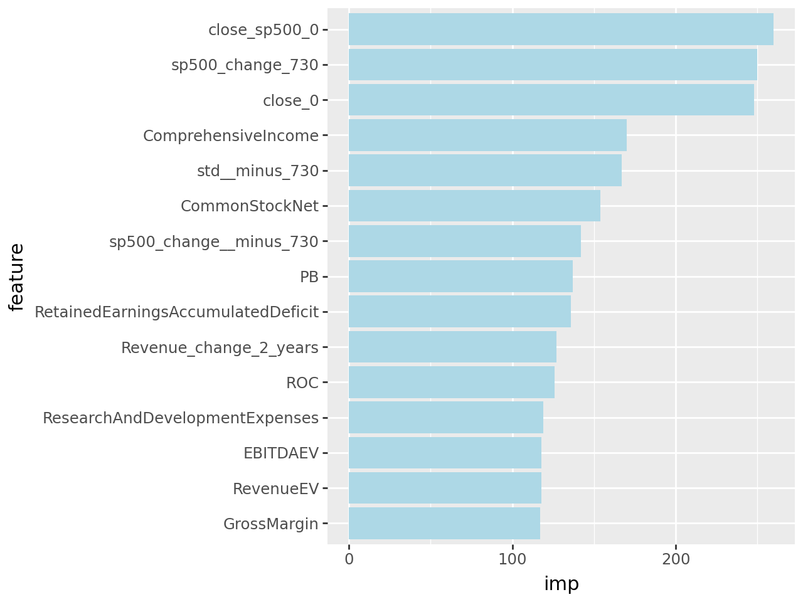
    


```python
# Quick check (dates where the data is split)
random_execution_date = data_set["execution_date"].iloc[int(len(data_set["execution_date"])/2+36652)]; print(random_execution_date, '\n')
train_set, test_set = split_train_test_by_period(data_set,random_execution_date,include_nulls_in_test = False)

print(train_set["execution_date"].iloc[0])
print(train_set["execution_date"].iloc[-1])
print('\n')
print(test_set["execution_date"].iloc[0])
print(test_set["execution_date"].iloc[-1])
```

    2017-09-30 00:00:00 
    
    2007-12-30 00:00:00
    2016-09-30 00:00:00
    
    
    2017-09-30 00:00:00
    2017-09-30 00:00:00


```python
num_models = 5
sorted_dates = sorted(all_models.keys())
selected_indexes = np.linspace(0, len(sorted_dates) - 1, num_models, dtype=int)
selected_dates = [sorted_dates[i] for i in selected_indexes]
selected_models = [all_models[date] for date in selected_dates]

all_feature_importance = []

for date, model in zip(selected_dates, selected_models):
    fi = model.feature_importance()
    fn = model.feature_name()
    
    feature_importance = pd.DataFrame({
        "feature": fn,
        "importance": fi,
        "execution_date": str(date) 
    })

    feature_importance = feature_importance.sort_values("importance", ascending=False).head(5)
    
    all_feature_importance.append(feature_importance)

df_feature_importance = pd.concat(all_feature_importance)

pivot_df = df_feature_importance.pivot(index="feature", columns="execution_date", values="importance")

fig, ax = plt.subplots(figsize=(12, 8))

colors = plt.cm.viridis(np.linspace(0.2, 0.8, len(pivot_df.columns)))

pivot_df.plot(kind="barh", ax=ax, alpha=0.7, color=colors, edgecolor="black", width=0.7)

ax.set_xlabel("Importance")
ax.set_ylabel("Feature")
ax.set_title("Feature Importance Across Execution Dates")
ax.legend(title="Execution Date", bbox_to_anchor=(1.05, 1), loc="upper left")
plt.grid(axis='x', linestyle='--', alpha=0.6)

plt.tight_layout()
plt.show()
```


    
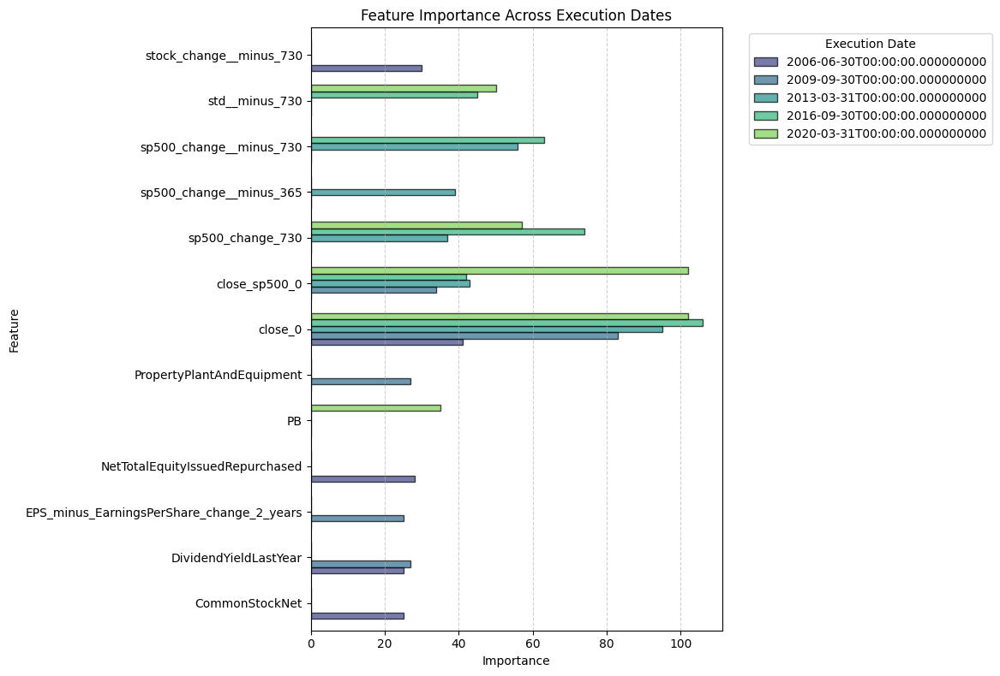
    


##### **Feature importance utilizando Shap**


```python
import shap

num_models = 5
sorted_dates = sorted(all_models.keys())
selected_indexes = np.linspace(0, len(sorted_dates) - 1, num_models, dtype=int)
selected_dates = [sorted_dates[i] for i in selected_indexes]
selected_models = [all_models[date] for date in selected_dates]

all_feature_importance = []

for date, model in zip(selected_dates, selected_models):
    feature_names = model.feature_name()
    
    # Compute SHAP values
    explainer = shap.TreeExplainer(model)
    X_sample = X_train.sample(n=500, random_state=42)  # Subsample for efficiency
    shap_values = explainer.shap_values(X_sample)

    # For binary classification, use shap_values[1] (positive class contributions)
    if isinstance(shap_values, list):
        shap_values = shap_values[1]  

    # Compute mean absolute SHAP value per feature
    mean_shap_values = np.abs(shap_values).mean(axis=0)
    
    feature_importance = pd.DataFrame({
        "feature": feature_names,
        "importance": mean_shap_values,
        "execution_date": str(date) 
    })

    feature_importance = feature_importance.sort_values("importance", ascending=False).head(5)
    
    all_feature_importance.append(feature_importance)

df_feature_importance = pd.concat(all_feature_importance)

pivot_df = df_feature_importance.pivot(index="feature", columns="execution_date", values="importance")

fig, ax = plt.subplots(figsize=(12, 8))

colors = plt.cm.viridis(np.linspace(0.2, 0.8, len(pivot_df.columns)))

pivot_df.plot(kind="barh", ax=ax, alpha=0.7, color=colors, edgecolor="black", width=0.7)

ax.set_xlabel("Mean Absolute SHAP Value")
ax.set_ylabel("Feature")
ax.set_title("Feature Importance Across Execution Dates (SHAP)")
ax.legend(title="Execution Date", bbox_to_anchor=(1.05, 1), loc="upper left")
plt.grid(axis='x', linestyle='--', alpha=0.6)

plt.tight_layout()
plt.show()
```


    
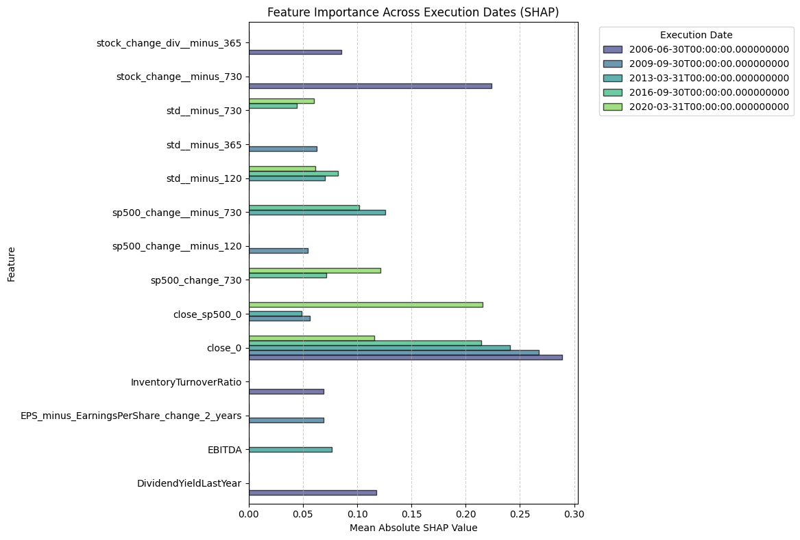
    


```python
plt.figure(figsize=(15, 6))
plt.plot(data_set['execution_date'], data_set['sp500_change_730'], marker='o', linestyle='-')

plt.xlabel("Execution Date")
plt.ylabel("SP 500 Change (730 Days)")
plt.title("SP 500 730-Day Change Over Execution Dates")
plt.xticks(rotation=45)
plt.grid(axis='y', linestyle='--', alpha=0.7)

plt.show()
```


    
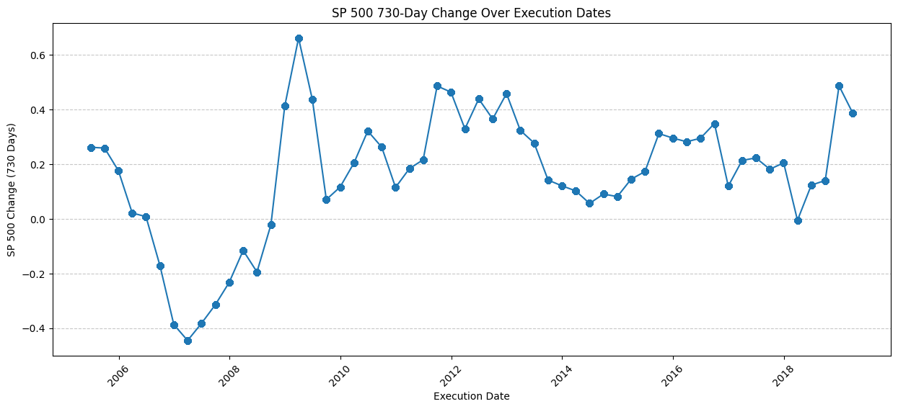
    


As it was expected, the suspicious variable `sp500_change_730` seems to be information "from the future", holding data of the % change of the stock price (with dividens) 2 years after `execution date`. The first suspicious fact is the existence of another feature `sp500_change__minus_730`, which is clearly from 2 years before. After that, I checked for NaN values in `sp500_change_730` and, as we expected, it has NaNs for every `execution date` after 2019-03-30 (exactly 2 years before the end of the dataset). This confirms that we are committing information leakage (at least) through this feature.

With a further investigation, we notice that both `close_0` and `close_sp500_0` features are data being published/obtained at the exact same moment when we are computing our top_n tickers. This means that we will not have this information when deploying the model in production.


```python
train_columns_list = train_set.columns.tolist()
print("\n".join(train_columns_list))
```

    Ticker
    date
    AssetTurnover
    CashFlowFromFinancialActivities
    CashFlowFromInvestingActivities
    CashFlowFromOperatingActivities
    CashOnHand
    ChangeInAccountsPayable
    ChangeInAccountsReceivable
    ChangeInAssetsLiabilities
    ChangeInInventories
    CommonStockDividendsPaid
    CommonStockNet
    ComprehensiveIncome
    CostOfGoodsSold
    CurrentRatio
    DaysSalesInReceivables
    DebtIssuanceRetirementNet_minus_Total
    DebtEquityRatio
    EBIT
    EBITMargin
    EBITDA
    EBITDAMargin
    FinancialActivities_minus_Other
    GoodwillAndIntangibleAssets
    GrossMargin
    GrossProfit
    IncomeAfterTaxes
    IncomeFromContinuousOperations
    IncomeFromDiscontinuedOperations
    IncomeTaxes
    Inventory
    InventoryTurnoverRatio
    InvestingActivities_minus_Other
    LongTermDebt
    Long_minus_TermInvestments
    Long_minus_termDebtCapital
    NetAcquisitionsDivestitures
    NetCashFlow
    NetChangeInIntangibleAssets
    NetChangeInInvestments_minus_Total
    NetChangeInLong_minus_TermInvestments
    NetChangeInPropertyPlantAndEquipment
    NetChangeInShort_minus_termInvestments
    NetCommonEquityIssuedRepurchased
    NetCurrentDebt
    NetIncome
    NetIncomeLoss
    NetLong_minus_TermDebt
    NetProfitMargin
    NetTotalEquityIssuedRepurchased
    OperatingExpenses
    OperatingIncome
    OperatingMargin
    OtherCurrentAssets
    OtherIncome
    OtherLong_minus_TermAssets
    OtherNon_minus_CashItems
    OtherNon_minus_CurrentLiabilities
    OtherOperatingIncomeOrExpenses
    OtherShareHoldersEquity
    Pre_minus_PaidExpenses
    Pre_minus_TaxIncome
    Pre_minus_TaxProfitMargin
    PropertyPlantAndEquipment
    ROA_minus_ReturnOnAssets
    ROE_minus_ReturnOnEquity
    ROI_minus_ReturnOnInvestment
    Receivables
    ReceiveableTurnover
    ResearchAndDevelopmentExpenses
    RetainedEarningsAccumulatedDeficit
    ReturnOnTangibleEquity
    Revenue
    SGAExpenses
    ShareHolderEquity
    Stock_minus_BasedCompensation
    TotalAssets
    TotalChangeInAssetsLiabilities
    TotalCommonAndPreferredStockDividendsPaid
    TotalCurrentAssets
    TotalCurrentLiabilities
    TotalDepreciationAndAmortization_minus_CashFlow
    TotalLiabilities
    TotalLiabilitiesAndShareHoldersEquity
    TotalLongTermLiabilities
    TotalLong_minus_TermAssets
    TotalNon_minus_CashItems
    TotalNon_minus_OperatingIncomeExpense
    execution_date
    close_0
    close_sp500_0
    stock_change_365
    stock_change_div_365
    sp500_change_365
    stock_change_730
    stock_change_div_730
    sp500_change_730
    stock_change__minus_120
    stock_change_div__minus_120
    sp500_change__minus_120
    stock_change__minus_365
    stock_change_div__minus_365
    sp500_change__minus_365
    stock_change__minus_730
    stock_change_div__minus_730
    sp500_change__minus_730
    std_730
    std__minus_120
    std__minus_365
    std__minus_730
    Market_cap
    n_finan_prev_year
    Enterprisevalue
    EBITDAEV
    EBITEV
    RevenueEV
    CashOnHandEV
    PFCF
    PE
    PB
    RDEV
    WorkingCapital
    ROC
    DividendYieldLastYear
    EPS_minus_EarningsPerShare_change_1_years
    EPS_minus_EarningsPerShare_change_2_years
    FreeCashFlowPerShare_change_1_years
    FreeCashFlowPerShare_change_2_years
    OperatingCashFlowPerShare_change_1_years
    OperatingCashFlowPerShare_change_2_years
    EBITDA_change_1_years
    EBITDA_change_2_years
    EBIT_change_1_years
    EBIT_change_2_years
    Revenue_change_1_years
    Revenue_change_2_years
    NetCashFlow_change_1_years
    NetCashFlow_change_2_years
    CurrentRatio_change_1_years
    CurrentRatio_change_2_years
    Market_cap__minus_365
    Market_cap__minus_730
    diff_ch_sp500
    count
    target


**Columns added to the function `columns_to_remove`:**

 `sp500_change_730`, `close_0` and `close_sp500_0`.

### **Possible overfitting?**
Let's dive into plotting the phase and learning curves in order to visualize the progress of training.


```python
def plot_phase_curve(evals_result):
    plt.figure(figsize=(10, 5))

    train_loss = evals_result["Train"]["binary_logloss"]
    test_loss = evals_result["Test"]["binary_logloss"]
    
    plt.plot(train_loss, label="Train Loss", marker=".", linestyle="-")
    plt.plot(test_loss, label="Test Loss", marker=".", linestyle="-")

    plt.xlabel("Boosting Rounds (Iterations)")
    plt.ylabel("Binary Logloss")
    plt.title("LightGBM Phase Curve (Loss vs Iterations)")
    plt.legend()
    plt.grid(alpha=0.3)

    plt.show()
```


```python
plot_phase_curve(evals_result=eval_result)
```


    
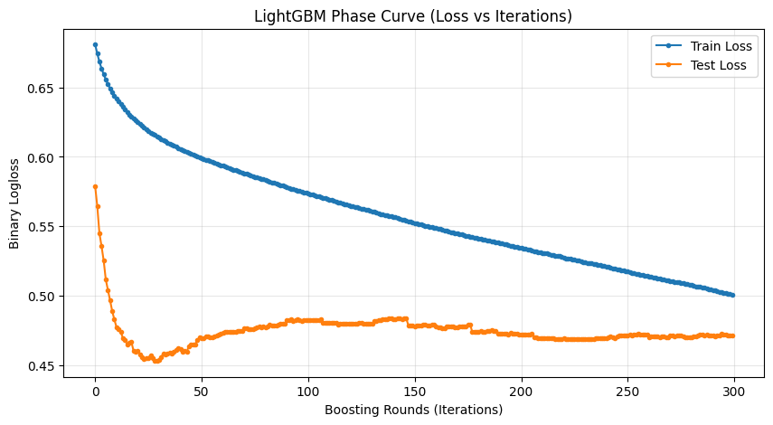
    


```python
from plotnine import geom_boxplot, labs

def plot_phase_curve_boxplot(evals_results_dict):
    """
    Visualizes the learning curves as a series of boxplots, showing 
    the distribution of logloss values at different execution dates.

    Parameters:
    - evals_results_dict: Dictionary with execution dates as keys and evals_result as values.
                          Each evals_result contains 'Train' and 'Test' logloss metrics.

    Returns:
    - ggplot boxplot of logloss distributions across execution dates.
    """
    
    df_list = []
    
    for execution_date, evals_result in evals_results_dict.items():
        train_loss = evals_result["Train"]["binary_logloss"]
        test_loss = evals_result["Test"]["binary_logloss"]
        
        df_temp = pd.DataFrame({
            "Boosting Round": list(range(len(train_loss))) * 2,
            "Logloss": train_loss + test_loss,
            "Dataset": ["Train"] * len(train_loss) + ["Test"] * len(test_loss),
            "Execution Date": str(execution_date)
        })
        
        df_list.append(df_temp)

    df_logloss = pd.concat(df_list, ignore_index=True)

    plot = (
        ggplot(df_logloss, aes(x="Execution Date", y="Logloss", fill="Dataset")) +
        geom_boxplot(alpha=0.6) +
        labs(title="Learning Curve Evolution (Logloss Distribution)",
             x="Execution Date", y="Binary Logloss") +
        theme_minimal()
    )

    return plot
```


```python
ggplot_phase_curve = plot_phase_curve_boxplot(all_results)
ggplot_phase_curve
```


    
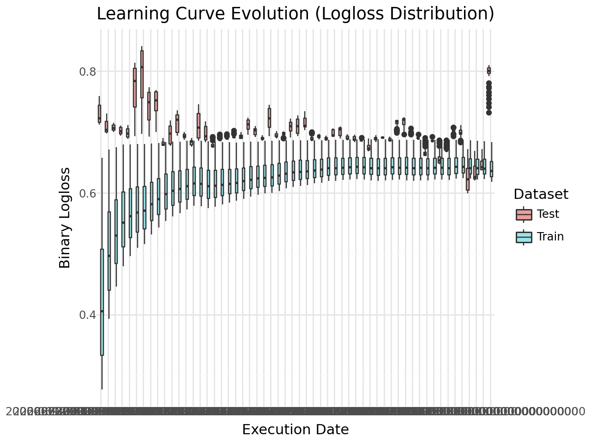
    


```python
from sklearn.model_selection import GridSearchCV
from sklearn.metrics import make_scorer, log_loss

def tune_lgbm_hyperparameters(train_set, test_set, param_grid=None, cv_folds=3):
    """
    Performs hyperparameter tuning using GridSearchCV for LightGBM.
    
    Parameters:
    - train_set: Training dataset (DataFrame)
    - test_set: Testing dataset (DataFrame)
    - param_grid: Dictionary of hyperparameters to tune
    - cv_folds: Number of cross-validation folds (default=5)
    
    Returns:
    - Best LightGBM model trained with optimal hyperparameters
    - Best hyperparameters found
    """

    columns_to_remove = get_columns_to_remove()
    X_train = train_set.drop(columns=columns_to_remove, errors="ignore")
    y_train = train_set["target"]

    if param_grid is None:
        param_grid = {
            'learning_rate': [0.01, 0.1],
            'num_leaves': [31, 50],
            'max_depth': [-1, 5],
            # 'min_child_samples': [10, 20],
            # 'reg_alpha': [0, 0.1, 0.5],  # L1 regularization
            # 'reg_lambda': [0, 0.1, 0.5],  # L2 regularization
            'n_estimators': [100, 300]
        }

    # Define the model
    lgb_model = lgb.LGBMClassifier(random_state=1, verbosity=-1, n_jobs=10)

    # Define scoring metric (log loss)
    scorer = make_scorer(log_loss, greater_is_better=False, needs_proba=True)

    grid_search = GridSearchCV(
        estimator=lgb_model,
        param_grid=param_grid,
        scoring=scorer,
        cv=cv_folds,
        verbose=2,
        n_jobs=10  
    )

    grid_search.fit(X_train, y_train)

    best_params = grid_search.best_params_
    best_model = grid_search.best_estimator_

    print("\nBest Hyperparameters Found:", best_params)
    return best_model, best_params
```


```python
# best_model, best_params = tune_lgbm_hyperparameters(train_set, test_set)
```

## **Redefine functions (where necessary)**


```python
def get_columns_to_remove2():
    columns_to_remove = [
                         "date",
                         "improve_sp500",
                         "Ticker",
                         "freq",
                         "set",
                         "close_sp500_365",
                         "close_365",
                         "stock_change_365",
                         "sp500_change_365",
                         "stock_change_div_365",
                         "stock_change_730",
                         "sp500_change_365",
                         "stock_change_div_730",
                         "diff_ch_sp500",
                         "diff_ch_avg_500",
                         "execution_date",
                         "target",
                         "index",
                         "quarter",
                         "std_730",
                         "count",
                         "sp500_change_730",
                         "close_0",
                         "close_sp500_0"
                         ]
        
    return columns_to_remove

def train_model2(train_set,test_set,n_estimators = 20):

    columns_to_remove = get_columns_to_remove2()
    
    X_train = train_set.drop(columns = columns_to_remove, errors = "ignore")
    X_test = test_set.drop(columns = columns_to_remove, errors = "ignore")
    
    
    y_train = train_set["target"]
    y_test = test_set["target"]

    lgb_train = lgb.Dataset(X_train,y_train)
    lgb_test = lgb.Dataset(X_test, y_test, reference=lgb_train)
    
    eval_result = {}
    
 
    objective = 'binary'
    metric = 'binary_logloss' 
    params = {
             "random_state":1, 
             "verbosity": -1,
             "n_jobs":10, 
             "n_estimators":n_estimators,
             "objective": objective,
             "metric": metric}
    
    model = lgb.train(params = params,
                      train_set = lgb_train,
                      valid_sets = [lgb_train, lgb_test],
                      valid_names=["Train", "Test"],
                      feval = [top_wt_performance],
                      callbacks = [lgb.record_evaluation(eval_result = eval_result)])
    return model,eval_result,X_train,X_test

def run_model_for_execution_date2(execution_date,all_results,all_predicted_tickers_list,all_models,n_estimators,include_nulls_in_test = False):
        global train_set
        global test_set
        # split the dataset between train and test
        train_set, test_set = split_train_test_by_period(data_set,execution_date,include_nulls_in_test = include_nulls_in_test)
        train_size, _ = train_set.shape
        test_size, _ = test_set.shape
        model = None
        X_train = None
        X_test = None
        
        # if both train and test are not empty
        if train_size > 0 and test_size>0:
            model, evals_result, X_train, X_test = train_model2(train_set,
                                                              test_set,
                                                              n_estimators = n_estimators)
            
            test_set['prob'] = model.predict(X_test)
            predicted_tickers = test_set.sort_values('prob', ascending = False)
            predicted_tickers["execution_date"] = execution_date
            all_results[(execution_date)] = evals_result
            all_models[(execution_date)] = model
            all_predicted_tickers_list.append(predicted_tickers)
        return all_results,all_predicted_tickers_list,all_models,model,X_train,X_test


execution_dates = np.sort( data_set['execution_date'].unique() )
```


```python
all_results = {}
all_predicted_tickers_list = []
all_models = {}

for execution_date in execution_dates:
    print(execution_date)
    all_results,all_predicted_tickers_list,all_models,model,X_train,X_test = run_model_for_execution_date2(execution_date,all_results,all_predicted_tickers_list,all_models,n_trees,False)
all_predicted_tickers = pd.concat(all_predicted_tickers_list) 

test_results = parse_results_into_df("Test")
train_results = parse_results_into_df("Train")

test_results_final_tree = test_results.sort_values(["execution_date","n_trees"]).drop_duplicates("execution_date",keep = "last")
train_results_final_tree = train_results.sort_values(["execution_date","n_trees"]).drop_duplicates("execution_date",keep = "last")
```

    2005-06-30T00:00:00.000000000
    2005-09-30T00:00:00.000000000
    2005-12-30T00:00:00.000000000
    2006-03-31T00:00:00.000000000
    2006-06-30T00:00:00.000000000
    2006-09-30T00:00:00.000000000
    2006-12-30T00:00:00.000000000
    2007-03-31T00:00:00.000000000
    2007-06-30T00:00:00.000000000
    2007-09-30T00:00:00.000000000
    2007-12-30T00:00:00.000000000
    2008-03-31T00:00:00.000000000
    2008-06-30T00:00:00.000000000
    2008-09-30T00:00:00.000000000
    2008-12-30T00:00:00.000000000
    2009-03-31T00:00:00.000000000
    2009-06-30T00:00:00.000000000
    2009-09-30T00:00:00.000000000
    2009-12-30T00:00:00.000000000
    2010-03-31T00:00:00.000000000
    2010-06-30T00:00:00.000000000
    2010-09-30T00:00:00.000000000
    2010-12-30T00:00:00.000000000
    2011-03-31T00:00:00.000000000
    2011-06-30T00:00:00.000000000
    2011-09-30T00:00:00.000000000
    2011-12-30T00:00:00.000000000
    2012-03-31T00:00:00.000000000
    2012-06-30T00:00:00.000000000
    2012-09-30T00:00:00.000000000
    2012-12-30T00:00:00.000000000
    2013-03-31T00:00:00.000000000
    2013-06-30T00:00:00.000000000
    2013-09-30T00:00:00.000000000
    2013-12-30T00:00:00.000000000
    2014-03-31T00:00:00.000000000
    2014-06-30T00:00:00.000000000
    2014-09-30T00:00:00.000000000
    2014-12-30T00:00:00.000000000
    2015-03-31T00:00:00.000000000
    2015-06-30T00:00:00.000000000
    2015-09-30T00:00:00.000000000
    2015-12-30T00:00:00.000000000
    2016-03-31T00:00:00.000000000
    2016-06-30T00:00:00.000000000
    2016-09-30T00:00:00.000000000
    2016-12-30T00:00:00.000000000
    2017-03-31T00:00:00.000000000
    2017-06-30T00:00:00.000000000
    2017-09-30T00:00:00.000000000
    2017-12-30T00:00:00.000000000
    2018-03-31T00:00:00.000000000
    2018-06-30T00:00:00.000000000
    2018-09-30T00:00:00.000000000
    2018-12-30T00:00:00.000000000
    2019-03-31T00:00:00.000000000
    2019-06-30T00:00:00.000000000
    2019-09-30T00:00:00.000000000
    2019-12-30T00:00:00.000000000
    2020-03-31T00:00:00.000000000
    2020-06-30T00:00:00.000000000
    2020-09-30T00:00:00.000000000
    2020-12-30T00:00:00.000000000
    2021-03-27T00:00:00.000000000


```python
ggplot(train_results_final_tree) + geom_point(aes(x = "execution_date", y = "weighted-return")) + theme(axis_text_x = element_text(angle = 90, vjust = 0.5, hjust=1))
```


    
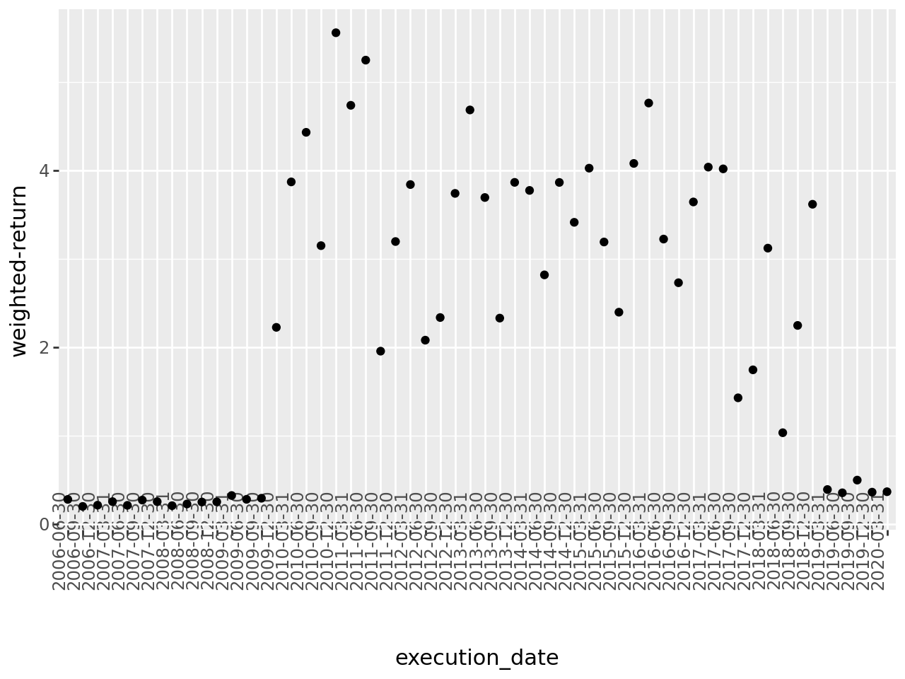
    


```python
ggplot(test_results_final_tree) + geom_point(aes(x = "execution_date", y = "weighted-return")) + theme(axis_text_x = element_text(angle = 90, vjust = 0.5, hjust=1))
```


    
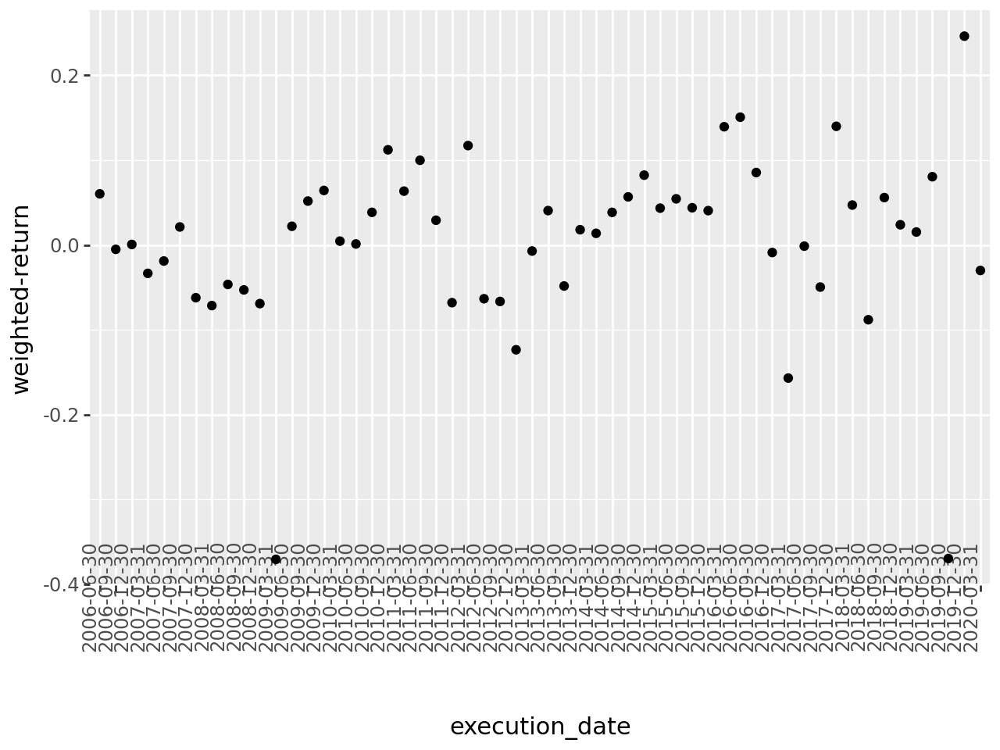
    


```python
num_models = 5
sorted_dates = sorted(all_models.keys())
selected_indexes = np.linspace(0, len(sorted_dates) - 1, num_models, dtype=int)
selected_dates = [sorted_dates[i] for i in selected_indexes]
selected_models = [all_models[date] for date in selected_dates]

all_feature_importance = []

for date, model in zip(selected_dates, selected_models):
    fi = model.feature_importance()
    fn = model.feature_name()
    
    feature_importance = pd.DataFrame({
        "feature": fn,
        "importance": fi,
        "execution_date": str(date) 
    })

    feature_importance = feature_importance.sort_values("importance", ascending=False).head(5)
    
    all_feature_importance.append(feature_importance)

df_feature_importance = pd.concat(all_feature_importance)

pivot_df = df_feature_importance.pivot(index="feature", columns="execution_date", values="importance")

fig, ax = plt.subplots(figsize=(12, 8))

colors = plt.cm.viridis(np.linspace(0.2, 0.8, len(pivot_df.columns)))

pivot_df.plot(kind="barh", ax=ax, alpha=0.7, color=colors, edgecolor="black", width=0.7)

ax.set_xlabel("Importance")
ax.set_ylabel("Feature")
ax.set_title("Feature Importance Across Execution Dates")
ax.legend(title="Execution Date", bbox_to_anchor=(1.05, 1), loc="upper left")
plt.grid(axis='x', linestyle='--', alpha=0.6)

plt.tight_layout()
plt.show()
```


    
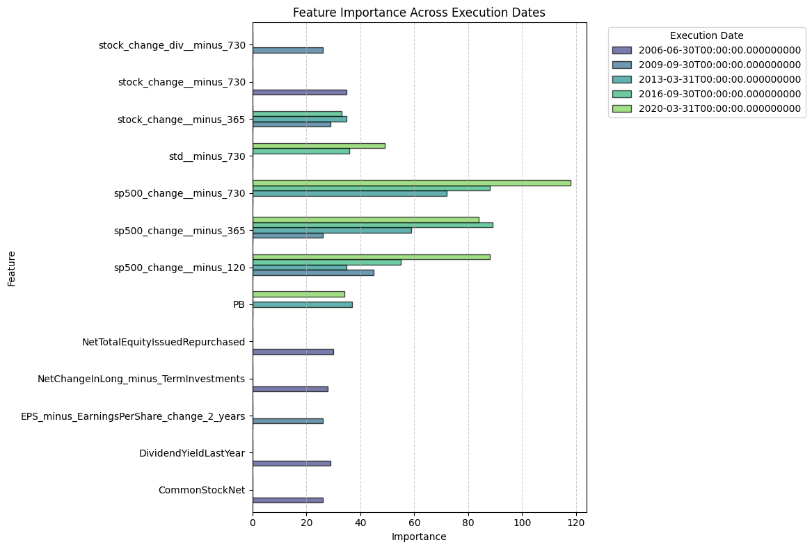
    


```python
ggplot_phase_curve = plot_phase_curve_boxplot(all_results)
ggplot_phase_curve
```


    
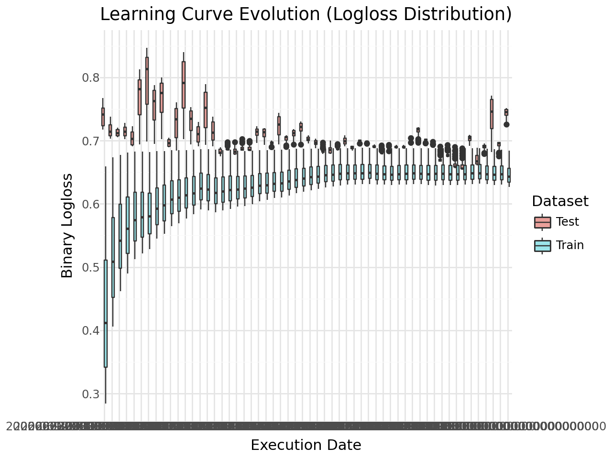
    


```python
train_outperformance = train_results_final_tree[train_results_final_tree['weighted-return'] > 0].shape[0] / train_results_final_tree.shape[0]
test_outperformance = test_results_final_tree[test_results_final_tree['weighted-return'] > 0].shape[0] / test_results_final_tree.shape[0]
print(f'Percentage of execution dates in which the chosen portfolio outperforms SP500 in train dataset: {round(train_outperformance*100, 2)}')
print(f'Percentage of execution dates in which the chosen portfolio outperforms SP500 in test dataset: {round(test_outperformance*100, 2)}')
print('\n')
mean_train_performance_difference = train_results_final_tree['weighted-return'].mean()
mean_test_performance_difference = test_results_final_tree['weighted-return'].mean()
print(f'Mean difference in performance (between our portfolio and SP500) for train dataset: {round(mean_train_performance_difference, 4)}')
print(f'Mean difference in performance (between our portfolio and SP500) for test dataset: {round(mean_test_performance_difference, 4)}')
print('\n')
median_train_performance_difference = train_results_final_tree['weighted-return'].median()
median_test_performance_difference = test_results_final_tree['weighted-return'].median()
print(f'Median difference in performance (between our portfolio and SP500) for train dataset: {round(median_train_performance_difference, 4)}')
print(f'Median difference in performance (between our portfolio and SP500) for test dataset: {round(median_test_performance_difference, 4)}')
```

    Percentage of execution dates in which the chosen portfolio outperforms SP500 in train dataset: 100.0
    Percentage of execution dates in which the chosen portfolio outperforms SP500 in test dataset: 60.71
    
    
    Mean difference in performance (between our portfolio and SP500) for train dataset: 2.312
    Mean difference in performance (between our portfolio and SP500) for test dataset: 0.0051
    
    
    Median difference in performance (between our portfolio and SP500) for train dataset: 2.3643
    Median difference in performance (between our portfolio and SP500) for test dataset: 0.0196

